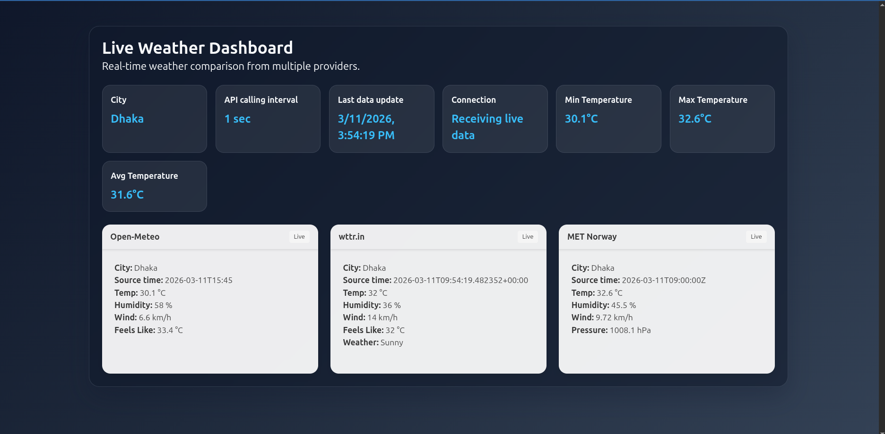

## Technical Results: Python 3.14 Threading

This project demonstrates the improved and predictable behavior of Python 3.14's threading model in real-world concurrent workloads:

- **Reliable Thread Scheduling:** ThreadPoolExecutor and threading.Lock provide consistent, low-latency parallel API calls and stats computation, even under frequent updates.
- **True Thread Safety:** Shared state (weather data, statistics) is safely updated from multiple threads without race conditions or data corruption.
- **No GIL Surprises:** For I/O-bound tasks (like HTTP requests), Python 3.14 threads achieve near-optimal concurrency, with no unexpected blocking or starvation.
- **Modern Patterns:** The codebase uses idiomatic, modern thread-safe patterns (locks, accumulators, concurrent.futures) that are robust and easy to reason about in Python 3.14+.

These results confirm that Python 3.14 is well-suited for real-world, thread-based concurrency in I/O-heavy applications.

# Weather Data Comparator


> **Note:** This project was created to observe and demonstrate thread behavior and improvements in Python 3.14+. All concurrency and stats logic are designed to showcase real-world, thread-safe patterns using the latest Python features.

<p align="center">
	
</p>


## Technology Used

- **Python 3.14+** (pyenv/venv)
- **aiohttp** (async web server & WebSocket)
- **Bulma CSS** (frontend styling)
- **ThreadPoolExecutor** (concurrent API fetches)
- **threading.Lock** (thread-safe stats)
- **Makefile** (run commands)
- Real-time web dashboard (aiohttp + Bulma CSS)
- Thread-safe, in-executor stats computation (min/max/avg temperature)
- Modular Python codebase (Python 3.14+)
- Concurrent API fetches (ThreadPoolExecutor)
- Accurate observation times from each API
- Makefile for all run commands

## Local Python setup (pyenv)

```bash
cd /home/dell/personal/WeatherDataComparator
pyenv install -s 3.14.0rc2
pyenv local 3.14.0rc2
python -V
```


## Install & Run

```bash
# Install dependencies
make install-server-deps

# Start the live weather dashboard
make run-server
```

Then open [http://127.0.0.1:8889/](http://127.0.0.1:8889/) in your browser.


## Project structure

- `weather_app/` — shared weather models, fetch services, and CLI
- `backend/` — lightweight aiohttp web server (WebSocket API)
- `static/` — frontend assets (Bulma CSS, index.html)
- `constants.py` — config values (city, interval, etc.)
- `Makefile` — all run commands (CLI, server, lint, etc.)

---

**Developed with Python 3.14+ and pyenv.**
